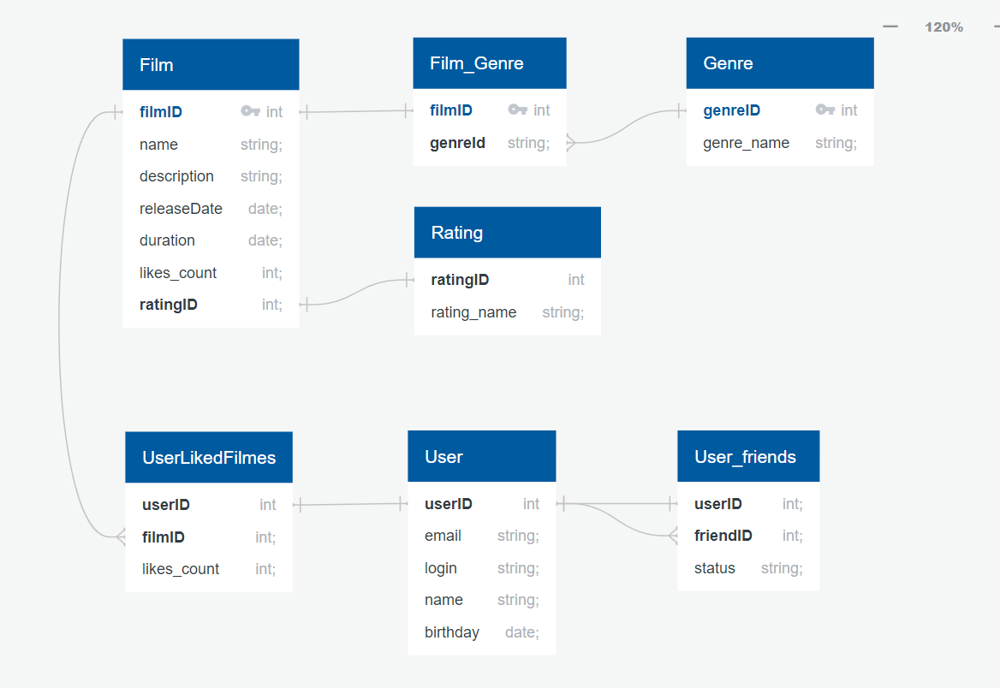

# ER cхема базы данных Filmorate
Данные для проекта Filmorate представлены в виде реляционной базы данных.
На схеме продемонстрированы отношения между таблицами User и Film.

## Описание схемы
В таблице Film хранятся данные о фильме(Название, описание, дата выхода, продолжительность, кол-во ценок и рейтинг)

- В таблице Film_Genre хранятся ключи таблиц FIlm и Genre, 1 ключу Film могут соответствовать несколько ключей Genre

- Таблица Rating хранит ID и название рейтинга фильма со связью 1 к 1

В таблице User хранятся данные о пользователе(ID, email, login, дата рождения, имя)

- Таблица User_friends показывает список друзей пользователя, включая их статус

- Таблица UserLikedFilmes показывает фильмы, которые пользователь добавил в список понравившихся

## Примеры запросов

1. Получение информации о всех фильмах

`SELECT *`

`FROM film;`

2. Получение информации о всех пользователях

`SELECT * `

`FROM user;`

3. Получение топа лучших фильмов

`SELECT *`

`FROM film`

`ORDER BY likes_count DESC`

`LIMIT 5;`

4. Получение название фильма и его рейтинга

`SELECT f.name, r.rating_name`

`FROM film AS f`

`JOIN rating_name AS r ON f.filmID = r.filmID;`

### [Ссылка на ER - диаграмму](https://app.quickdatabasediagrams.com/#/d/SdUQq8)

