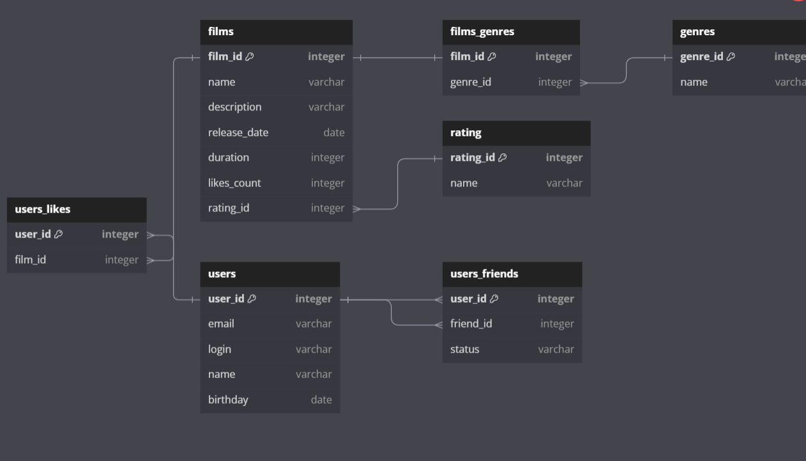

# Filmorate

**Filmorate** — это сервис для управления фильмами и пользовательскими оценками, который помогает выбирать фильмы для просмотра, основываясь на предпочтениях пользователей. Проект реализован на основе Spring Boot с использованием встроенной базы данных H2 для хранения данных и собирается в Docker. Данные сохраняются между запусками приложения, а интеграционные тесты обеспечивают надежность функциональности.

## Обзор проекта

Filmorate предоставляет пользователям возможность:

- **Добавлять фильмы**: указывать название, описание, дату релиза, жанры и рейтинг (MPA).
- **Искать фильмы**: просматривать список всех фильмов или конкретный фильм по ID.
- **Оценивать фильмы**: ставить лайки и формировать персонализированные рекомендации.
- **Управлять дружбой**: отправлять односторонние заявки в друзья для обмена рекомендациями.
- **Работать с жанрами и рейтингами**: получать списки жанров и рейтингов (MPA) или конкретные записи по ID.

**Основные сущности**:
- **Film**: фильм с атрибутами (название, описание, дата релиза, жанры, рейтинг MPA).
- **User**: пользователь, который может лайкать фильмы и добавлять друзей.
- **Genre**: жанр фильма (например, "Комедия", "Драма").
- **Mpa**: рейтинг фильма (например, "G", "PG").
- **Friendship**: односторонняя связь между пользователями.

Сервис поддерживает CRUD-операции для фильмов и пользователей, а также управление жанрами, рейтингами и дружбой через REST API.

## Модули

### Модуль сервера
**Репозиторий**: Filmorate Server  
**Описание**: Основной модуль сервиса, содержащий REST API для управления фильмами, пользователями, жанрами, рейтингами и дружбой. Реализован на Spring Boot, использует встроенную базу данных H2 для хранения данных (в файле для рабочего режима, в памяти для тестов). Собирается в Docker-контейнер.

**Основные функции**:
- **Управление пользователями**:
  - Создание пользователя (`POST /users`).
  - Обновление профиля (`PUT /users/{id}`).
  - Получение пользователя по ID (`GET /users/{id}`).
  - Получение списка всех пользователей (`GET /users`).
  - Управление дружбой (односторонняя): добавление друга (`PUT /users/{id}/friends/{friendId}`), удаление друга (`DELETE /users/{id}/friends/{friendId}`).
- **Управление фильмами**:
  - Добавление фильма (`POST /films`, с указанием жанров и MPA).
  - Обновление фильма (`PUT /films/{id}`).
  - Получение фильма по ID (`GET /films/{id}`).
  - Получение списка всех фильмов (`GET /films`).
  - Добавление/удаление лайка (`PUT/DELETE /films/{id}/like/{userId}`).
- **Управление жанрами**:
  - Получение списка всех жанров (`GET /genres`).
  - Получение жанра по ID (`GET /genres/{id}`).
- **Управление рейтингами (MPA)**:
  - Получение списка всех рейтингов (`GET /mpa`).
  - Получение рейтинга по ID (`GET /mpa/{id}`).

**Пример ответа для жанра**:
```json
{
  "id": 1,
  "name": "Комедия"
}
```

# ER cхема базы данных Filmorate
Данные для проекта Filmorate представлены в виде реляционной базы данных.
На схеме продемонстрированы отношения между таблицами User и Film.



## Описание схемы
В таблице films хранятся данные о фильме(Название, описание, дата выхода, продолжительность, кол-во ценок и рейтинг)

- В таблице films_genres хранятся ключи таблиц films и genres.

- Таблица rating хранит ID и название рейтинга фильма со связью * к 1

В таблице users хранятся данные о пользователе(ID, email, login, дата рождения, имя)

- Таблица users_friends показывает список друзей пользователя, включая их статус

- Таблица users_likes показывает фильмы, которые пользователь добавил в список понравившихся

## Примеры запросов

1. Получение информации о всех фильмах

`SELECT *`

`FROM films;`

2. Получение информации о всех пользователях

`SELECT * `

`FROM users;`

3. Получение топа лучших фильмов

`SELECT *`

`FROM films`

`ORDER BY likes_count DESC`

`LIMIT 5;`

4. Получение название фильма и его рейтинга

`SELECT f.name, r.name`

`FROM films AS f`

`JOIN rating AS r ON f.rating_id = r.rating_id;`


### [Ссылка на ER - диаграмму](https://dbdiagram.io/d/671e8a8197a66db9a36d5e78)


